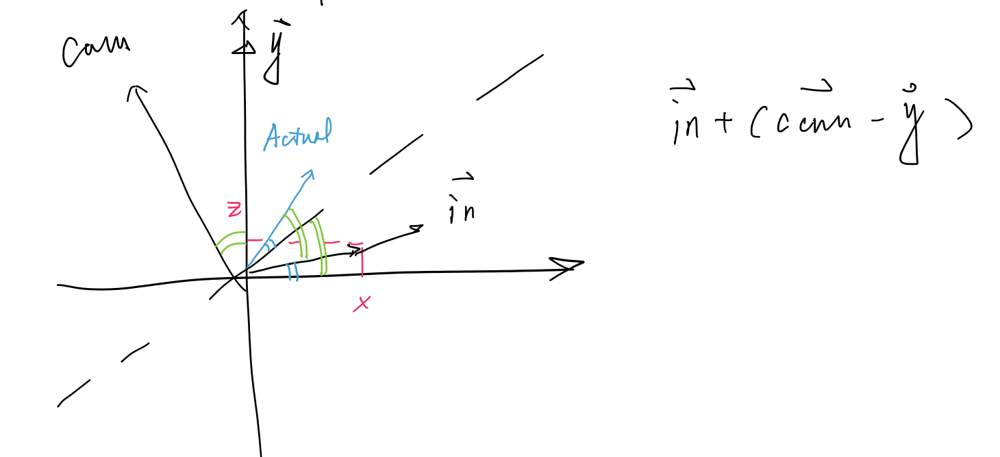

# FF14-raid-Simulator

制作总结。

**冰圈特效**：不想画圆，直接用图片素材。

​	prefab 里的：地面 aoe，空中 3 白圈，地面 aoe碰撞圆。地面 aoe 和白圈是图片，碰撞圆是球，压缩y 到0.01，并且用 mesh collider。记住，要collision或者 trigger enter事件必须要在碰撞体上加入刚体和 collider 两个 component。控制脚本是IceRingEffect.cs。

​	代码里生成的：旋转的冰锥。冰锥本身是 prefab。控制公转的脚本是 Orbit.cs。

## 玩家

模型：免费商店素材Meshtint Free Chicken。

**玩家朝相机正方向移动**。

​	获取相机正方向：`GetCamForward`，用 transform 的 forward 属性，除去 Y 轴的坐标，然后 normalize。

​	获取输入：Input.GetAxis。

​	Challenge：输入的是标准坐标系的上下左右向量。相机旋转后，要以相机正方向重新计算运动方向的向量。

​	解决：如果不做任何处理，直接用 GetAxis 得到的方向（图中的 in）进行移动，那么相机无论怎么转，都是按照世界坐标系的 in 移动。由于相机旋转了（图中绿色角），我们在世界坐标系里的移动也需要旋转。

​	旋转角度的获取：`Vector3.Angle(Vector3.forward, camForward) / 180 * Mathf.PI`。Angle 方法获取的角度只有 0~180，所以如果 cam 方向的 X>0，要用 2pi 减去得到的结果。

​	旋转 input 向量：使用旋转矩阵，手算。注意旋转矩阵是逆时针的。

**减小输入惯性**：将Input Manager 输入 axis 的 gravity设为比较高的值。

**玩家逐渐转向至前进方向**。使用欧拉旋转角度（忘了四元数）。**逐渐**转向的逐渐由微积分思路得来，转动=`\int_startAngle^endAngle spinSpeed dx`。

​	旋转目标方向：上面 in向量旋转后的结果，称之为`towards`。

​	原旋转角度： `rot_y=transform.eulerAngles.y`。

​	微小旋转量：`\delta = towards-rot_y`。

​	旋转：`tranform.Rotate`。

​	盲点：首先，要将`towards`向量转为 y 轴的旋转角度，同样用 V3.Angle。

​	其次，如果现在朝向前方，想要转到左方，`towards`就是 270，`rot_y=0`。`tranform.Rotate`是顺时针，于是这样就会从右半边转到左边，但是更好的是左转 90 度。于是就要写判断，从更小的角度的那一边转过去。